# Agent Sparrow Backend Architecture Documentation

## Table of Contents
1. [System Overview](#system-overview)
2. [Architecture Diagram](#architecture-diagram)
3. [Core Components](#core-components)
4. [Directory Structure](#directory-structure)
5. [Agent System](#agent-system)
6. [API Layer](#api-layer)
7. [Database Integration](#database-integration)
8. [Frontend-Backend Communication](#frontend-backend-communication)
9. [Security & Authentication](#security--authentication)
10. [Rate Limiting](#rate-limiting)
11. [Development Setup](#development-setup)

## System Overview

Agent Sparrow is a sophisticated multi-agent AI system built on FastAPI with a Next.js frontend. The backend implements an orchestrated agent graph using LangGraph, with specialized agents for different tasks (primary agent, log analysis, research, reflection). The system integrates with Supabase for data persistence and supports multiple AI providers.

Re-organization note: canonical imports are now `app.agents.*` (compat remains for `app.agents_v2.*`). Endpoint modules have been updated to use the canonical imports.

## Architecture Diagram

```mermaid
graph TB
    subgraph "Frontend Layer"
        NextJS[Next.js App]
        MW[Middleware]
        UC[Unified Client]
    end

    subgraph "API Gateway"
        CORS[CORS Middleware]
        RL[Rate Limiter]
        Auth[Auth Middleware]
        FastAPI[FastAPI Server]
    end

    subgraph "Agent Orchestration Layer"
        AG[Agent Graph<br/>app/agents_v2/orchestration/graph.py]
        Router[Query Router<br/>app/agents_v2/router/router.py]
        PreProc[Pre-Process Node]
        PostProc[Post-Process Node]
        Escalate[Escalation Node]
    end

    subgraph "Agent Nodes"
        PA[Primary Agent<br/>app/agents_v2/primary_agent/agent.py]
        LA[Log Analysis Agent<br/>app/agents_v2/log_analysis_agent/agent.py]
        RA[Research Agent<br/>app/agents_v2/research_agent/research_agent.py]
        RF[Reflection Agent<br/>app/agents_v2/reflection/node.py]
    end

    subgraph "Agent Components"
        RE[Reasoning Engine<br/>reasoning_engine.py]
        TS[Troubleshooting Module<br/>troubleshooting/]
        PS[Problem Solver<br/>problem_solver.py]
        TI[Tool Intelligence<br/>tool_intelligence.py]
        AB[Adapter Bridge<br/>adapter_bridge.py]
    end

    subgraph "Tools Layer"
        ToolNode[Tool Node]
        MKB[Mailbird KB Search]
        TWS[Tavily Web Search]
        RT[Research Tools<br/>app/tools/research_tools.py]
        LAT[Log Analysis Tools<br/>app/tools/log_analysis_tools.py]
        URT[User Research Tools<br/>app/tools/user_research_tools.py]
    end

    subgraph "Provider Layer"
        PR[Provider Registry<br/>app/providers/registry.py]
        GeminiAdapter[Gemini Adapter<br/>Google/Gemini-2.5-Flash/adapter.py]
        OpenAIAdapter[OpenAI Adapter<br/>OpenAI/GPT-5-Mini/adapter.py]
    end

    subgraph "Data Layer"
        SC[Supabase Client<br/>app/db/supabase_client.py]
        Models[DB Models<br/>app/db/models.py]
        Embeddings[Embedding Utils<br/>app/db/embedding_utils.py]
        Session[Session Manager<br/>app/db/session.py]
    end

    subgraph "Core Services"
        Settings[Settings<br/>app/core/settings.py]
        UserContext[User Context<br/>app/core/user_context.py]
        Security[Security Module<br/>app/core/security.py]
        RateLimiting[Rate Limiting<br/>app/core/rate_limiting/]
        QualityMgr[Quality Manager<br/>app/core/quality_manager.py]
        Cache[Redis Cache<br/>app/cache/redis_cache.py]
    end

    subgraph "External Services"
        Supabase[(Supabase DB)]
        Redis[(Redis)]
        Gemini[Google Gemini API]
        OpenAI[OpenAI API]
        Tavily[Tavily API]
    end

    %% Frontend to Backend connections
    NextJS --> MW
    MW --> UC
    UC --> |HTTP/WebSocket| FastAPI

    %% API Gateway flow
    FastAPI --> CORS
    CORS --> RL
    RL --> Auth
    Auth --> AG

    %% Agent Graph flow
    AG --> PreProc
    PreProc --> |Check Cache| Router
    Router --> |Route Decision| PA
    Router --> |Log Query| LA
    Router --> |Research Query| RA

    %% Agent interactions
    PA --> RE
    PA --> AB
    RE --> PS
    RE --> TI
    PA --> RF
    RF --> |Refine| PA
    RF --> |Complete| PostProc
    RF --> |Escalate| Escalate

    %% Tool interactions
    PA --> ToolNode
    LA --> ToolNode
    RA --> ToolNode
    ToolNode --> MKB
    ToolNode --> TWS
    ToolNode --> RT
    ToolNode --> LAT
    ToolNode --> URT

    %% Provider connections
    AB --> PR
    PR --> GeminiAdapter
    PR --> OpenAIAdapter
    GeminiAdapter --> Gemini
    OpenAIAdapter --> OpenAI
    TWS --> Tavily

    %% Data layer connections
    FastAPI --> SC
    SC --> Supabase
    FastAPI --> Models
    FastAPI --> Session
    FastAPI --> Embeddings

    %% Core services
    FastAPI --> Settings
    FastAPI --> UserContext
    FastAPI --> Security
    FastAPI --> RateLimiting
    FastAPI --> QualityMgr
    RateLimiting --> Cache
    Cache --> Redis

    style PA fill:#e1f5fe
    style LA fill:#e1f5fe
    style RA fill:#e1f5fe
    style RF fill:#e1f5fe
    style AG fill:#fff3e0
    style FastAPI fill:#f3e5f5
    style Supabase fill:#c8e6c9
    style Redis fill:#ffccbc
    style Gemini fill:#ffeb3b
```



## Core Components

### 1. FastAPI Application (`app/main.py`)
- **Purpose**: Main application entry point and API server
- **Key Features**:
  - CORS middleware for cross-origin requests
  - Rate limiting via SlowAPI
  - OpenTelemetry integration for tracing
  - Dynamic router registration based on configuration
  - Global exception handlers for rate limiting

### 2. Agent Graph (`app/agents_v2/orchestration/graph.py`)
- **Purpose**: Orchestrates the flow between different agents
- **Components**:
  - StateGraph for managing agent state
  - Router node for query classification
  - Agent nodes (primary, log analysis, research)
  - Tool node for external tool execution
  - Reflection node for quality assurance
  - Pre/post processing nodes

### 3. Primary Agent (`app/agents_v2/primary_agent/agent.py`)
- **Purpose**: Main conversational agent handling general queries
- **Features**:
  - Reasoning engine integration
  - Tool intelligence for smart tool usage
  - Troubleshooting capabilities
  - Support for thinking budget (Gemini 2.5)
  - Streaming responses
- **Key Files**:
  - `reasoning_engine.py`: Core reasoning logic
  - `problem_solver.py`: Problem-solving strategies
  - `tool_intelligence.py`: Tool selection intelligence
  - `adapter_bridge.py`: Provider abstraction

### 4. Log Analysis Agent (`app/agents_v2/log_analysis_agent/`)
- **Purpose**: Specialized agent for analyzing logs and debugging
- **Components**:
  - `agent.py`: Main agent logic
  - `simplified_agent.py`: Simplified version for basic analysis
  - `extractors/`: Log pattern extractors
  - `tools/`: Log-specific tools

### 5. Research Agent (`app/agents_v2/research_agent/research_agent.py`)
- **Purpose**: Handles research queries and information gathering
- **Features**:
  - Web search integration
  - Knowledge base search
  - Multi-source aggregation

### 6. Reflection Agent (`app/agents_v2/reflection/node.py`)
- **Purpose**: Quality assurance and response refinement
- **Features**:
  - Response quality checking
  - Iterative refinement
  - Escalation for complex issues

## Directory Structure

```
app/
├── agents/                 # NEW: canonical agents package (compat re-exports to agents_v2)
│   ├── primary/            # Primary conversational agent (re-export)
│   ├── log_analysis/       # Log analysis agent (re-export)
│   ├── research/           # Research agent (re-export)
│   ├── reflection/         # Reflection (re-export)
│   └── orchestration/      # Graph + state (re-export)
├── agents_v2/              # Legacy import path (still present; slated for removal later)
│   ├── primary_agent/      # Main conversational agent
│   │   ├── agent.py        # Agent implementation
│   │   ├── reasoning/      # Reasoning components
│   │   ├── troubleshooting/# Debug & troubleshooting
│   │   └── prompts/        # Agent prompts
│   ├── log_analysis_agent/ # Log analysis specialist
│   ├── research_agent/     # Research specialist
│   ├── reflection/         # Quality assurance
│   ├── orchestration/      # Agent orchestration
│   └── router/             # Query routing logic
├── api/                    # API layer
│   ├── middleware/         # API middleware
│   └── v1/
│       ├── endpoints/      # API endpoints
│       └── websocket/      # WebSocket handlers
├── core/                   # Core utilities
│   ├── transport/          # NEW: unified SSE/WebSocket helpers (skeleton)
│   └── tracing/            # NEW: observability helpers (skeleton)
│   ├── rate_limiting/      # Rate limiting system
│   ├── auth.py            # Authentication
│   ├── settings.py        # Configuration
│   └── security.py        # Security utilities
├── db/                     # Database layer
│   ├── supabase/           # NEW: client + repositories (compat wrapper to supabase_client)
│   └── embedding/          # NEW: embedding utils (compat wrapper to embedding_utils)
│   ├── models.py          # SQLAlchemy models
│   ├── supabase_client.py # Supabase integration
│   └── migrations/        # Database migrations
├── providers/              # AI provider adapters
│   ├── adapters/           # NEW: adapters namespace (skeleton)
│   └── limits/             # NEW: rate limit wrappers/config (skeleton)
│   ├── Google/            # Google Gemini
│   └── OpenAI/            # OpenAI GPT
├── tools/                  # Agent tools
├── cache/                  # Caching layer
└── feedme/                 # FeedMe feature module
```

## Agent System

### Agent State Management
The system uses a GraphState object to maintain conversation state across agents:
```python
class GraphState:
    messages: List[BaseMessage]
    user_info: Dict
    next: str
    api_key: str
    thinking_budget: Optional[int]
    cached_response: Optional[str]
```

### Agent Flow
1. **Pre-processing**: Cache check, user context setup
2. **Routing**: Query classification to appropriate agent
3. **Agent Execution**: Specialized agent processes query
4. **Tool Execution**: External tools if needed
5. **Reflection**: Quality check and refinement
6. **Post-processing**: Response formatting and caching

### Reasoning Engine
The reasoning engine (`reasoning_engine.py`) implements:
- Multi-step reasoning chains
- Context-aware decision making
- Tool selection intelligence
- Problem decomposition
- Solution synthesis

## API Layer

For detailed developer guides, see:
- docs/backend/primary-agent.md
- docs/backend/log-analysis-agent.md

### Key Endpoints

#### Agent Endpoints (modularized)
- chat_endpoints.py: `POST /api/v1/v2/agent/chat/stream` – Primary Agent streaming (SSE)
- unified_endpoints.py: `POST /api/v1/agent/unified/stream` – Unified stream routing to primary/log-analysis/research
- logs_endpoints.py: `POST /api/v1/agent/logs` (JSON), `POST /api/v1/agent/logs/stream` (SSE), sessions and rate-limits
- research_endpoints.py: `POST /api/v1/agent/research` (JSON), `POST /api/v1/agent/research/stream` (SSE)

Streaming contracts:
- Primary chat stream emits: `text-start`, `text-delta`, optional `data-*` metadata, `text-end`, `finish`.
- Unified stream (log analysis) emits timeline steps as `{ type: 'step', data: {...} }` and a final assistant message with `analysis_results`.

#### Advanced Agent Endpoints (`advanced_agent_endpoints.py`)
- `POST /api/v1/advanced/reasoning/structured` – Structured reasoning
- `POST /api/v1/advanced/troubleshoot/mailbird` – Mailbird-specific troubleshooting
- `POST /api/v1/advanced/research` – Research mode

#### FeedMe Endpoints (`feedme_endpoints.py`)
- `POST /api/v1/feedme/ingest` – Transcript ingestion
- `GET /api/v1/feedme/conversations` – List conversations
- `POST /api/v1/feedme/folders` – Folder management
- WebSocket support: `/ws/feedme` for real-time updates

#### Authentication Endpoints (`auth.py`)
- `POST /api/v1/auth/login` – User login (when enabled)
- `POST /api/v1/auth/refresh` – Token refresh
- `POST /api/v1/auth/logout` – User logout
- JWT-based authentication (Supabase)

## Database Integration

Canonical imports:
- Supabase: `from app.db.supabase.client import get_supabase_client`
- Embeddings utils: `from app.db.embedding.utils import ...`

### Supabase Client (`supabase_client.py`)
Provides typed operations for:
- **Folder Management**: Create, update, delete folders
- **Conversation Persistence**: Store chat sessions
- **User Data**: User preferences and settings
- **API Key Storage**: Encrypted key management

### Database Models (`models.py`)
```python
class UserAPIKey:
    - id: Primary key
    - user_id: User identifier
    - api_key_type: Provider type (gemini, openai, etc.)
    - encrypted_key: Encrypted API key
    - is_active: Status flag
    - created_at/updated_at: Timestamps

class APIKeyAuditLog:
    - Audit trail for API key operations
    - No sensitive data storage
```

## Frontend-Backend Communication

### Unified Client (`frontend/lib/providers/unified-client.ts`)
- Abstracts backend communication
- Handles streaming responses
- Manages authentication tokens
- Message history management

#### SSE Helpers
Streaming endpoints use `app/core/transport/sse.py` → `format_sse_data(payload)` for consistent Server‑Sent Event formatting across agents.

### Communication Flow
1. Frontend sends request via unified client
2. Request includes auth token, session ID, message
3. Backend processes through agent graph
4. Streaming response sent back via SSE/WebSocket
5. Frontend renders incremental updates

### Authentication Flow
1. User logs in via Supabase Auth
2. JWT token stored in cookies
3. Middleware validates token on each request
4. User context injected into agent state

## Security & Authentication

### Authentication System
- **Supabase Auth Integration**: Primary auth provider
- **JWT Tokens**: Session management
- **Local Auth Bypass**: Development mode option
- **Middleware Protection**: Route-level auth checks

### Security Features
- **API Key Encryption**: All keys encrypted at rest
- **Rate Limiting**: Multi-level rate limiting
- **CORS Configuration**: Controlled origin access
- **Input Validation**: Pydantic models for validation
- **Audit Logging**: API key operation tracking

## Rate Limiting

### Multi-Level System
1. **Global Rate Limiter** (SlowAPI):
   - Request-level limiting
   - IP-based throttling

2. **Service-Specific Limiters**:
   - **Gemini Rate Limiter**: Token bucket algorithm
   - **Embedding Limiter**: Embedding API limits
   - **Circuit Breaker**: Failure protection

3. **Configuration** (`app/core/rate_limiting/config.py`):
   ```python
   RATE_LIMITS = {
       "gemini-2.5-flash": {
           "rpm": 1000,
           "tpm": 4000000,
           "rpd": 10000
       }
   }
   ```

## Development Setup

### Environment Variables
```bash
# Core Configuration
ENVIRONMENT=development
SKIP_AUTH=true  # Development only
DEVELOPMENT_USER_ID=dev-user-12345

# API Keys
GEMINI_API_KEY=your-gemini-key
OPENAI_API_KEY=your-openai-key
TAVILY_API_KEY=your-tavily-key

# Supabase
SUPABASE_URL=your-supabase-url
SUPABASE_ANON_KEY=your-anon-key
SUPABASE_SERVICE_KEY=your-service-key

# Redis (optional)
REDIS_URL=redis://localhost:6379

# Security
JWT_SECRET_KEY=your-jwt-secret
ENABLE_LOCAL_AUTH_BYPASS=false
```

### Running the Backend
```bash
# Install dependencies
pip install -r requirements.txt

# Run development server
uvicorn app.main:app --reload --port 8000

# Or use the start script
python app/main.py
```

### Key Development Features
- **Hot Reload**: Automatic restart on code changes
- **Mock Mode**: Run without external dependencies
- **Debug Logging**: Comprehensive logging system
- **OpenTelemetry**: Performance tracing (optional)

## Provider System

### Provider Registry (`app/providers/registry.py`)
- Dynamic provider registration
- Adapter pattern for multiple AI providers
- Fallback mechanisms

### Supported Providers
1. **Google Gemini** (Primary):
   - Models: gemini-2.5-flash, 
   - Features: Thinking mode, streaming, function calling

2. **OpenAI**:
   - Models: GPT5-mini
   - Features: Thinking mode, Function calling, streaming

### Adding New Providers
1. Create adapter in `app/providers/<provider>/`
2. Implement base adapter interface
3. Register in provider registry
4. Update configuration

## Troubleshooting Module

### Components (`app/agents_v2/primary_agent/troubleshooting/`)
- **Error Analysis**: Pattern matching for common errors
- **Solution Database**: Known issue resolutions
- **Diagnostic Tools**: System state inspection
- **Guided Debugging**: Step-by-step troubleshooting

## Cache System

### Redis Cache (`app/cache/redis_cache.py`)
- Response caching for repeated queries
- Session state caching
- Rate limit state storage
- Configurable TTL

## WebSocket Support

### FeedMe WebSocket (`app/api/v1/websocket/feedme_websocket.py`)
- Real-time transcript processing
- Live conversation updates
- Bidirectional communication
- Connection management

## Quality Management

### Quality Manager (`app/core/quality_manager.py`)
- Response quality metrics
- Performance monitoring
- Error tracking
- User satisfaction signals

## Best Practices for New Developers

### 1. Agent Development
- Extend base agent classes
- Implement proper error handling
- Use structured logging
- Follow state management patterns

### 2. API Development
- Use Pydantic for validation
- Implement proper status codes
- Add comprehensive documentation
- Include rate limiting decorators

### 3. Testing
- Unit tests for agent logic
- Integration tests for API endpoints
- Mock external services
- Load testing for performance

### 4. Security
- Never log sensitive data
- Encrypt all stored credentials
- Validate all inputs
- Use parameterized queries

### 5. Performance
- Use caching strategically
- Implement pagination
- Optimize database queries
- Monitor rate limits

## Common Patterns

### Stream Processing
```python
async def stream_response():
    async for chunk in agent.astream(state):
        yield format_chunk(chunk)
```

### Error Handling
```python
try:
    result = await agent.process(query)
except RateLimitExceeded:
    return rate_limit_response()
except Exception as e:
    logger.error(f"Agent error: {e}")
    return error_response()
```

### State Management
```python
state = GraphState(
    messages=[HumanMessage(content=query)],
    user_info=user_context,
    api_key=user_api_key
)
```

## Monitoring & Debugging

### Logging
- Structured logging with context
- Log levels: DEBUG, INFO, WARNING, ERROR
- Centralized logging configuration

### OpenTelemetry
- Distributed tracing
- Performance metrics
- Error tracking
- Custom spans for agent operations

### Health Checks
- `/api/health`: System health
- `/api/v1/rate-limits/status`: Rate limit status
- Database connectivity checks

## Deployment Considerations

### Production Setup
1. Set `ENVIRONMENT=production`
2. Configure proper JWT secret
3. Enable authentication endpoints
4. Set up Redis for caching
5. Configure rate limits appropriately
6. Set up monitoring/alerting

### Scaling
- Horizontal scaling via load balancer
- Redis for shared state
- Database connection pooling
- Async processing for heavy operations

### Security Hardening
- Enable all security features
- Regular security audits
- API key rotation policy
- Audit log retention

## Conclusion

This backend architecture provides a robust, scalable foundation for the Agent Sparrow system. The multi-agent orchestration, combined with comprehensive security, caching, and rate limiting, ensures reliable and performant AI interactions. New developers should focus on understanding the agent graph flow and state management patterns before making modifications.