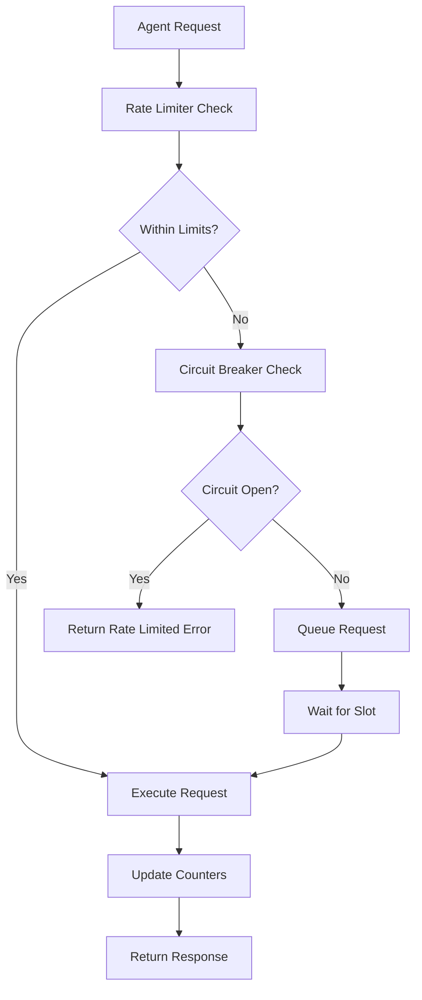

# Rate Limiting System Design for MB-Sparrow

## Overview

A comprehensive rate limiting system to ensure MB-Sparrow operates entirely within Google Gemini's free tier limits, preventing any charges while maintaining service quality.

## System Requirements

### Functional Requirements
1. **Zero Overage Guarantee**: Prevent exceeding Gemini free tier limits
2. **Distributed Rate Limiting**: Work across multiple server instances
3. **Per-Model Tracking**: Separate limits for Flash and Pro models
4. **Graceful Degradation**: Handle rate limit approach gracefully
5. **Circuit Breaker**: Protect against cascading failures
6. **Real-time Monitoring**: Track usage and provide metrics

### Non-Functional Requirements
1. **Performance**: <10ms latency overhead
2. **Reliability**: 99.9% availability
3. **Scalability**: Support horizontal scaling
4. **Observability**: Comprehensive logging and metrics

## Architecture Design

### Core Components

#### 1. Token Bucket Rate Limiter
```python
class TokenBucket:
    """
    Token bucket algorithm for smooth rate limiting.
    Allows burst requests while maintaining average rate.
    """
    - capacity: Maximum tokens (requests per window)
    - refill_rate: Tokens added per second
    - current_tokens: Available tokens
    - last_refill: Timestamp of last refill
```

#### 2. Redis-Based Distributed Limiter
```python
class RedisRateLimiter:
    """
    Redis-backed distributed rate limiter using sliding window.
    Ensures consistency across multiple server instances.
    """
    - redis_client: Redis connection
    - key_prefix: Namespace for rate limit keys
    - sliding_window: Time-based request tracking
```

#### 3. Gemini Model Rate Limiter
```python
class GeminiRateLimiter:
    """
    Model-specific rate limiter with safety margins.
    Coordinates between RPM and RPD limits.
    """
    - flash_limiter: Rate limiter for gemini-2.5-flash
    - pro_limiter: Rate limiter for gemini-2.5-pro
    - safety_margin: Percentage buffer (default: 20%)
```

#### 4. Circuit Breaker
```python
class CircuitBreaker:
    """
    Circuit breaker to prevent cascading failures.
    States: CLOSED -> OPEN -> HALF_OPEN -> CLOSED
    """
    - failure_threshold: Failed requests before opening
    - timeout: Time before attempting recovery
    - success_threshold: Successful requests to close
```

### System Flow



## Implementation Strategy

### Phase 1: Core Rate Limiting Infrastructure

#### 1.1 Token Bucket Implementation
**File**: `app/core/rate_limiting/token_bucket.py`
```python
class TokenBucket:
    def __init__(self, capacity: int, refill_rate: float):
        self.capacity = capacity
        self.refill_rate = refill_rate
        self.tokens = capacity
        self.last_refill = time.time()
    
    async def consume(self, tokens: int = 1) -> bool:
        await self._refill()
        if self.tokens >= tokens:
            self.tokens -= tokens
            return True
        return False
    
    async def _refill(self):
        now = time.time()
        elapsed = now - self.last_refill
        self.tokens = min(
            self.capacity,
            self.tokens + (elapsed * self.refill_rate)
        )
        self.last_refill = now
```

#### 1.2 Redis Rate Limiter
**File**: `app/core/rate_limiting/redis_limiter.py`
```python
class RedisRateLimiter:
    def __init__(self, redis_client, key_prefix: str):
        self.redis = redis_client
        self.key_prefix = key_prefix
    
    async def is_allowed(
        self, 
        identifier: str, 
        limit: int, 
        window_seconds: int
    ) -> tuple[bool, dict]:
        # Sliding window counter implementation
        # Returns (allowed, metadata)
        pass
```

#### 1.3 Gemini Rate Limiter
**File**: `app/core/rate_limiting/gemini_limiter.py`
```python
class GeminiRateLimiter:
    def __init__(self, redis_client):
        self.redis_limiter = RedisRateLimiter(redis_client, "gemini_rl")
        self.flash_limits = {
            "rpm": 8,  # 80% of 10
            "rpd": 200  # 80% of 250
        }
        self.pro_limits = {
            "rpm": 4,   # 80% of 5
            "rpd": 80   # 80% of 100
        }
    
    async def check_flash_limits(self) -> RateLimitResult:
        # Check both RPM and RPD for Flash model
        pass
    
    async def check_pro_limits(self) -> RateLimitResult:
        # Check both RPM and RPD for Pro model  
        pass
```

#### 1.4 Circuit Breaker
**File**: `app/core/rate_limiting/circuit_breaker.py`
```python
class CircuitBreaker:
    def __init__(self, failure_threshold: int = 5, timeout: int = 60):
        self.failure_threshold = failure_threshold
        self.timeout = timeout
        self.state = CircuitState.CLOSED
        self.failure_count = 0
        self.last_failure_time = None
        self.success_count = 0
    
    async def call(self, func, *args, **kwargs):
        if self.state == CircuitState.OPEN:
            if self._should_attempt_reset():
                self.state = CircuitState.HALF_OPEN
            else:
                raise CircuitBreakerOpenException()
        
        try:
            result = await func(*args, **kwargs)
            self._on_success()
            return result
        except Exception as e:
            self._on_failure()
            raise
```

### Phase 2: Agent Integration

#### 2.1 Rate Limited Agent Wrapper
**File**: `app/core/rate_limiting/agent_wrapper.py`
```python
class RateLimitedAgent:
    def __init__(self, agent, rate_limiter, circuit_breaker):
        self.agent = agent
        self.rate_limiter = rate_limiter
        self.circuit_breaker = circuit_breaker
    
    async def invoke(self, *args, **kwargs):
        # Check rate limits
        rate_limit_result = await self.rate_limiter.check_limits()
        
        if not rate_limit_result.allowed:
            raise RateLimitExceededException(rate_limit_result.metadata)
        
        # Execute with circuit breaker protection
        return await self.circuit_breaker.call(
            self.agent.invoke, *args, **kwargs
        )
```

#### 2.2 Decorator Pattern
```python
def rate_limited(model: str):
    def decorator(func):
        @wraps(func)
        async def wrapper(*args, **kwargs):
            # Rate limiting logic
            return await func(*args, **kwargs)
        return wrapper
    return decorator

# Usage
@rate_limited("gemini-2.5-flash")
async def primary_agent_invoke(messages):
    # Existing agent logic
    pass
```

### Phase 3: Configuration and Monitoring

#### 3.1 Configuration Management
**File**: `app/core/rate_limiting/config.py`
```python
@dataclass
class RateLimitConfig:
    flash_rpm_limit: int = 8
    flash_rpd_limit: int = 200
    pro_rpm_limit: int = 4
    pro_rpd_limit: int = 80
    redis_key_prefix: str = "mb_sparrow_rl"
    circuit_breaker_enabled: bool = True
    circuit_breaker_failure_threshold: int = 5
    circuit_breaker_timeout: int = 60
    monitoring_enabled: bool = True
```

#### 3.2 Monitoring and Metrics
**File**: `app/core/rate_limiting/monitoring.py`
```python
class RateLimitMonitor:
    def __init__(self, redis_client):
        self.redis = redis_client
    
    async def get_usage_stats(self) -> Dict[str, Any]:
        return {
            "flash": {
                "rpm_used": await self._get_rpm_usage("flash"),
                "rpd_used": await self._get_rpd_usage("flash"),
                "circuit_state": await self._get_circuit_state("flash")
            },
            "pro": {
                "rpm_used": await self._get_rpm_usage("pro"),
                "rpd_used": await self._get_rpd_usage("pro"),
                "circuit_state": await self._get_circuit_state("pro")
            }
        }
```

## Error Handling Strategy

### Error Types
1. **RateLimitExceededException**: When rate limit is hit
2. **CircuitBreakerOpenException**: When circuit breaker is open
3. **GeminiServiceUnavailableException**: When service is down

### Error Responses
```python
class RateLimitError:
    message: str = "Rate limit exceeded. Please try again later."
    retry_after: int  # Seconds until retry is allowed
    limits: Dict[str, int]  # Current limits and usage
    
class CircuitBreakerError:
    message: str = "Service temporarily unavailable."
    estimated_recovery: datetime  # When service might be available
```

### Graceful Degradation
1. **Request Queuing**: Queue requests when approaching limits
2. **Response Caching**: Cache responses to reduce API calls
3. **Fallback Responses**: Provide cached or simplified responses
4. **User Notifications**: Clear error messages with retry guidance

## Testing Strategy

### Unit Tests
- Token bucket algorithm correctness
- Redis rate limiter functionality
- Circuit breaker state transitions
- Configuration validation

### Integration Tests
- End-to-end rate limiting with real Redis
- Agent wrapper functionality
- Error handling paths
- Monitoring and metrics collection

### Load Tests
- Simulate high request volume
- Verify limits are enforced under load
- Test circuit breaker activation
- Validate no rate limit bypass possible

### Compliance Tests
- Ensure no requests exceed free tier limits
- Validate safety margins work correctly
- Test edge cases and race conditions

## Deployment Considerations

### Environment Variables
```bash
# Rate Limiting Configuration
GEMINI_FLASH_RPM_LIMIT=8
GEMINI_FLASH_RPD_LIMIT=200
GEMINI_PRO_RPM_LIMIT=4
GEMINI_PRO_RPD_LIMIT=80
RATE_LIMIT_REDIS_URL=redis://localhost:6379/3
RATE_LIMIT_REDIS_PREFIX=mb_sparrow_rl
CIRCUIT_BREAKER_ENABLED=true
CIRCUIT_BREAKER_FAILURE_THRESHOLD=5
CIRCUIT_BREAKER_TIMEOUT=60
MONITORING_ENABLED=true
```

### Redis Configuration
- Dedicated Redis database for rate limiting
- Appropriate memory limits and eviction policies
- Monitoring for Redis health and performance

### Monitoring Setup
- Prometheus metrics for rate limit usage
- Grafana dashboards for visualization
- Alerts for approaching limits or circuit breaker activation

---
**Design Version**: 1.0
**Date**: 2025-07-01
**Next Review**: After implementation phase