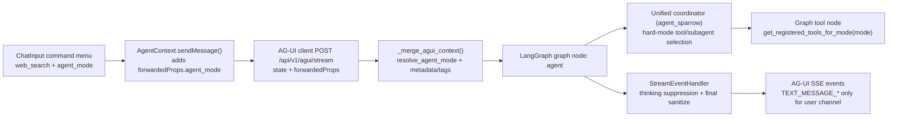

# Prompt + Routing Regression Forensic Report

Date: 2026-02-13  
Scope: prompt layering, hard mode routing, tool registry, degraded fallback output, frontend mode contract, event/sanitization path.

## Task 1 - Prompt Source Forensics (file/line evidence)

| Source | Evidence | Role in Runtime | Regression Link | Remediation State |
|---|---|---|---|---|
| `app/agents/unified/prompts.py` | `NINE_STEP_REASONING_BASE` (line anchors: 60-104), mode roles (line anchors: 554-595), coordinator composition (line anchors: 614-690), subagent prompt adoption (line anchors: 720-929) | Canonical reasoning base + coordinator/subagent role layering | Older prompt stack had global Mailbird framing (`git show 7cc2b5e:app/agents/unified/prompts.py` lines 158-164) | Shared 9-step base + mode overlays applied; default coordinator no longer globally Mailbird-scoped |
| `app/agents/unified/subagents.py` | Mode-gated subagent builder list (line anchors: 895-971) | Keeps delegation within selected mode | Cross-mode subagent availability previously unconstrained | Mode-constrained subagent set enforced by `agent_mode` |
| `app/agents/unified/agent_sparrow.py` | Mode resolution + tactical override guard (line anchors: 421-490), mode-aware tool/subagent composition (line anchors: 747-898), autoroute hinting without mode switch (line anchors: 1163-1232) | Main coordinator runtime + routing control plane | Legacy `agent_type` could influence behavior without strict mode policy | Hard mode selection persisted and enforced end-to-end |
| `app/api/v1/endpoints/agui_endpoints.py` | Mode-aware context merge (line anchors: 765-938), degraded fallback prompt/sanitization (line anchors: 384-447) | AG-UI ingest + degraded reply path | `a141af0` fallback scaffold used support-incident wording (`git show a141af0:app/api/v1/endpoints/agui_endpoints.py` lines 394-397) | Fallback now mode-neutral + sanitized through `ThinkingBlockTracker` |
| `app/agents/unified/thread_state.py` | Thread-state extraction prompt (line anchors: 37-56) | Secondary summarization prompt for long-run context continuity | Not primary regression source; establishes additional prompt surface | No hard-mode override logic in this file; retained as context extractor |
| `app/agents/unified/playbooks/enricher.py` | Extraction prompt (line anchors: 46-80) | FeedMe/playbook learning prompt surface | Not root-cause; separate extraction workflow with its own schema | Left intact; no mode/routing side effects |

## Task 2 - Request Flow Diagram (Frontend -> Backend -> Graph -> Streaming)

Primary file anchors:
- Frontend AG-UI send path: `frontend/src/services/ag-ui/client.ts` (line anchors: 219-230)
- AG-UI context merge: `app/api/v1/endpoints/agui_endpoints.py` (line anchors: 765-938)
- Graph mode-scoped tool node: `app/agents/orchestration/orchestration/graph.py` (line anchors: 164-223)
- Stream sanitization safety net: `app/agents/streaming/handler.py` (line anchors: 292-331)

## Task 3 - Mode/Tool Capability Matrix

Evidence sources: `app/agents/unified/tools.py`, `app/agents/unified/minimax_tools.py`

| Mode | Registry Function | `generate_image` | `log_diagnoser` | Minimax Conditional Tools | Notes |
|---|---|---|---|---|---|
| `general` | `_general_mode_tools()` (`app/agents/unified/tools.py`, line anchor 2949) | Yes (`app/agents/unified/tools.py`, line anchor 2962) | Yes (`app/agents/unified/tools.py`, line anchor 2956) | Yes via `_web_lookup_tools()` (`app/agents/unified/tools.py`, line anchor 2937) and `is_minimax_available()` (`app/agents/unified/minimax_tools.py`, line anchor 91) | Full general profile |
| `mailbird_expert` | `_mailbird_mode_tools()` (`app/agents/unified/tools.py`, line anchor 2970) | No | Yes (`app/agents/unified/tools.py`, line anchor 2978) | Optional `minimax_web_search` fallback (`app/agents/unified/tools.py`, line anchor 2982) | Support-safe constrained toolset |
| `research_expert` | `_research_mode_tools()` (`app/agents/unified/tools.py`) | No | No direct log tool in mode list | Yes through `_web_lookup_tools()` | Retrieval + synthesis focus |
| `creative_expert` | `_creative_mode_tools()` (`app/agents/unified/tools.py`, line anchor 3008) | Yes (`app/agents/unified/tools.py`, line anchor 3012) | No | Optional image-understanding + web search (`app/agents/unified/tools.py`, line anchor 3019) | Artifact/image-first profile |

Historical regression evidence:
- `generate_image` existed as a tool definition but was omitted from registry composition in `ed5b3d8` (`git show ed5b3d8:app/agents/unified/tools.py` lines 2699-2767).

## Task 4 - Commit Timeline + Branch Containment

Evidence from `git show` and `git branch --contains`.

| Commit | Date | Observed Impact | Branch Containment Evidence |
|---|---|---|---|
| `7cc2b5e` | 2026-01-28 | Large Minimax/subagent integration + prompt structure containing global Mailbird expertise block | Contained in `main` and current branch |
| `2ae7689` | 2026-01-28 | Merge commit for PR #53 (sub-agent minimax) | Contained in `main` and current branch |
| `ed5b3d8` | 2026-01-30 | Tool registration drift: `generate_image` missing from coordinator registry composition | Contained in `main` and current branch |
| `04f3175` | 2026-02-11 | Thinking panel / stream pipeline phase updates (event path complexity increased) | Contained in current branch family (`Thinking_panel_2.0(2)`) |
| `a141af0` | 2026-02-12 | Degraded fallback used support-incident scaffold in user channel | Contained in current branch family (`Thinking_panel_2.0(2)`) |

Root-cause mapping:
- Prompt persona drift: broad Mailbird framing in coordinator static prompt lineage.
- Hard-switch drift: legacy `agent_type` routing influence without strict mode guard.
- Output degradation drift: fallback prompt content intended for internal support incident framing.
- Capability drift: defined tool (`generate_image`) not surfaced in active registries.

## Task 5 - Output/Event Sanitization Matrix

Evidence sources: `app/patches/agui_custom_events.py`, `app/agents/streaming/handler.py`, `app/api/v1/endpoints/agui_endpoints.py`

| Stage | File Evidence | Guardrail | Risk Addressed |
|---|---|---|---|
| AG-UI custom event patching | `app/patches/agui_custom_events.py` (line anchors: 209, 225) | Forces `stream_mode="custom"` and JSON-safe normalization/sanitization | Dropped/malformed custom events and unsafe payload serialization |
| Thinking-block suppression | `app/agents/streaming/handler.py` (line anchors: 173-274) | `ThinkingBlockTracker.process_chunk()` filters hidden reasoning blocks during stream | Thought leakage into main text channel |
| Final content sanitizer | `app/agents/streaming/handler.py` (line anchors: 292-331) | `sanitize_final_content()` strips residual thinking blocks + markdown data URIs | Residual hidden traces or artifact noise in final output |
| Degraded fallback sanitizer parity | `app/api/v1/endpoints/agui_endpoints.py` (line anchor: 443) | Applies `ThinkingBlockTracker.sanitize_final_content(...)` before fallback emission | Fallback text bypassing normal sanitization path |
| Degraded fallback prompt neutrality | `app/api/v1/endpoints/agui_endpoints.py` (line anchors: 417-421) | Mode-aware neutral fallback instruction; no support-incident scaffolding | "Production support incident" spill in user-facing output |

## Task 6 - Frontend/Backend Contract Summary

### Frontend contract

| Component | Evidence | Contract Behavior |
|---|---|---|
| `AgentContext` | `frontend/src/features/librechat/AgentContext.tsx` (line anchors: 84-88, 1501-1513, 2045-2049) | Maintains `agentMode` state, persists into run metadata/forwarded props, does not force mode changes from attachments |
| `ChatInput` | `frontend/src/features/librechat/components/ChatInput.tsx` (line anchors: 547-621) | Command menu exposes web search toggle + expert-mode selector in composer |
| `LibreChatClient` | `frontend/src/features/librechat/LibreChatClient.tsx` (line anchors: 198-205, 721-760, 842-849) | Loads/stores per-session mode metadata and wires provider callbacks |
| AG-UI client payload | `frontend/src/services/ag-ui/client.ts` (line anchors: 44-56) | Initial AG-UI state includes `agent_mode` (default `general`) |
| Session API client | `frontend/src/services/api/endpoints/sessions.ts` (line anchors: 4-8, 92-104) | Create/update payload includes `agent_mode`, metadata merged with mode |
| Models API client | `frontend/src/services/api/endpoints/models.ts` (line anchors: 144-152) | Sends `agent_mode` query with model-list request |

### Backend contract

| Endpoint/Schema | Evidence | Contract Behavior |
|---|---|---|
| AG-UI ingest | `app/api/v1/endpoints/agui_endpoints.py` (line anchors: 814-818) | Resolves effective mode from explicit mode > legacy type map > default |
| Graph state | `app/agents/orchestration/orchestration/state.py` (line anchors: 327-333) | `GraphState` now carries `agent_mode` as first-class runtime field |
| Session schemas | `app/schemas/chat_schemas.py` (line anchors: 31-37, 52-55, 142-144) | Public enum + defaults for `agent_mode` |
| Session endpoints | `app/api/v1/endpoints/chat_session_endpoints.py` (line anchors: 127-138, 957-960, 1359-1390) | Normalizes metadata mode, supports mode filtering in list APIs |
| Models endpoint | `app/api/v1/endpoints/models_endpoints.py` (line anchors: 80-93) | Accepts and validates `agent_mode` query (future mode-specific model filtering hook) |

## Verification Snapshot

- Backend targeted tests:
  - `tests/agents/test_agent_mode_hard_switch.py`
  - `tests/api/test_agui_mode_contract.py`
- Frontend type safety:
  - `pnpm -s typecheck`

All above passed on 2026-02-13.
