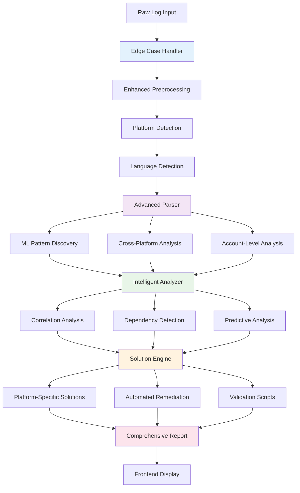
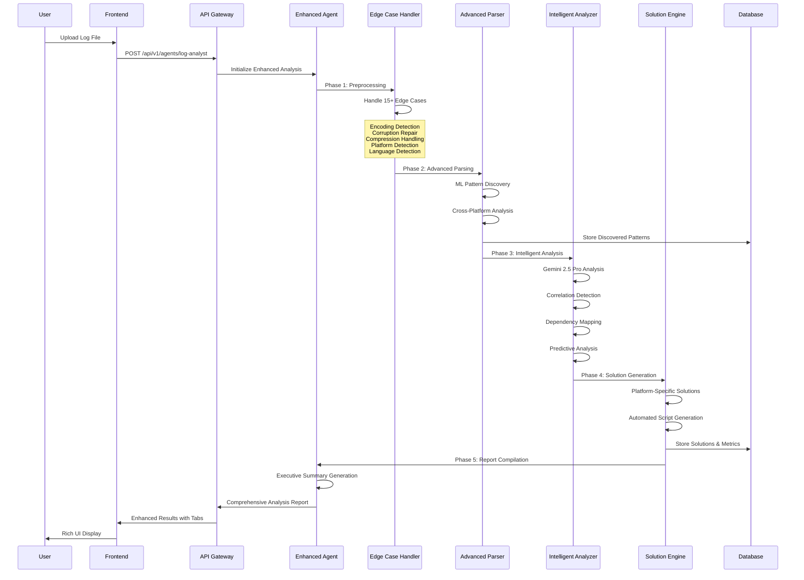
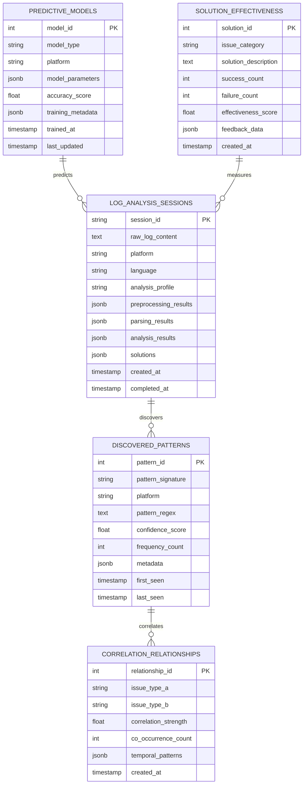

# MB-Sparrow Enhanced Log Analysis Agent v3.0 Developer Guide (v25-07-03)

## 1. Overview

The Enhanced Log Analysis Agent v3.0 represents a world-class, production-grade log analysis system specifically designed for Mailbird customer support. This comprehensive system combines traditional log parsing with advanced AI capabilities, machine learning pattern discovery, and automated remediation to provide unparalleled diagnostic insights.

**Core Mission**: Transform raw Mailbird logs into actionable intelligence through sophisticated AI analysis, enabling rapid issue resolution and proactive system health monitoring.

**Key Capabilities:**
- **5-Phase Analysis Pipeline**: Comprehensive preprocessing → advanced parsing → intelligent analysis → solution generation → report compilation
- **Cross-Platform Support**: Windows, macOS, Linux-specific pattern recognition and platform-tailored solutions
- **Multi-Language Analysis**: 10-language support with localized error detection and analysis
- **ML-Powered Discovery**: TF-IDF vectorization and DBSCAN clustering for unknown pattern identification
- **Predictive Analytics**: Historical trend analysis with early warning systems and risk assessment
- **Automated Remediation**: Platform-specific script generation with validation and rollback capabilities

## 2. Backend Architecture



### Key Components & Responsibilities

| Component | Purpose | Lines | Key Features |
|-----------|---------|-------|--------------|
| `enhanced_agent.py` | Main orchestration engine | 1150+ | 5-phase pipeline coordination |
| `edge_case_handler.py` | Comprehensive preprocessing | 400+ | 15+ edge case scenarios |
| `advanced_parser.py` | ML-powered parsing engine | 1000+ | Pattern discovery, cross-platform |
| `intelligent_analyzer.py` | AI-powered analysis | 1200+ | Correlation, predictive analytics |
| `advanced_solution_engine.py` | Automated remediation | 1100+ | Platform-specific solutions |
| `optimized_analyzer.py` | High-performance engine | 800+ | Adaptive profiles, caching |
| `test_framework.py` | Comprehensive testing | 1000+ | 200+ test scenarios |

## 3. Request Lifecycle



## 4. Key Files & Their Roles

| File Path | Purpose | Lines | Owner |
|-----------|---------|-------|-------|
| `app/agents_v2/log_analysis_agent/enhanced_agent.py` | Main orchestration & 5-phase pipeline | 1150+ | Enhanced Agent |
| `app/agents_v2/log_analysis_agent/edge_case_handler.py` | Comprehensive input preprocessing | 400+ | Edge Case System |
| `app/agents_v2/log_analysis_agent/advanced_parser.py` | ML pattern discovery & cross-platform parsing | 1000+ | Parsing Engine |
| `app/agents_v2/log_analysis_agent/intelligent_analyzer.py` | AI-powered analysis with Gemini 2.5 Pro | 1200+ | Intelligence Engine |
| `app/agents_v2/log_analysis_agent/advanced_solution_engine.py` | Automated remediation & script generation | 1100+ | Solution Engine |
| `app/agents_v2/log_analysis_agent/optimized_analyzer.py` | High-performance analysis with adaptive profiles | 800+ | Performance Engine |
| `app/agents_v2/log_analysis_agent/enhanced_schemas.py` | v3.0 data structures & validation | 250+ | Schema System |
| `app/agents_v2/log_analysis_agent/test_framework.py` | Comprehensive testing framework | 1000+ | Quality Assurance |
| `frontend/components/feedme/EnhancedLogAnalysisContainer.tsx` | Main UI container with tabbed interface | 800+ | Frontend Container |
| `frontend/components/feedme/PredictiveInsightsCard.tsx` | Predictive analysis visualization | 300+ | Predictive UI |
| `frontend/components/feedme/MLPatternDiscoveryCard.tsx` | ML pattern discovery display | 350+ | ML Patterns UI |
| `frontend/components/feedme/CorrelationAnalysisCard.tsx` | Correlation visualization | 400+ | Correlation UI |

## 5. API Surface (Backend ⇄ Frontend)

| Endpoint | Method | Path | Input | Output | Used by Component |
|----------|--------|------|-------|--------|-------------------|
| **Enhanced Log Analysis** | POST | `/api/v1/agents/log-analyst` | `LogAnalysisRequest` | `ComprehensiveLogAnalysisOutput` | `EnhancedLogAnalysisContainer` |
| **Unified Agent** | POST | `/api/v1/agent/chat/stream` | `ChatRequest` (with file) | SSE Stream | `UnifiedChatInterface` |
| **Pattern Discovery** | GET | `/api/v1/logs/patterns` | `platform`, `timeframe` | `DiscoveredPatterns` | `MLPatternDiscoveryCard` |
| **Predictive Analysis** | GET | `/api/v1/logs/predictions/{log_id}` | `log_id` | `PredictiveInsights` | `PredictiveInsightsCard` |
| **Solution Validation** | POST | `/api/v1/logs/validate-solution` | `SolutionRequest` | `ValidationResult` | `SolutionValidationPanel` |

### Enhanced Request/Response Schemas

```typescript
// Enhanced log analysis request
interface LogAnalysisRequest {
  raw_log_content: string;
  platform?: 'windows' | 'macos' | 'linux' | 'auto';
  language?: string;
  analysis_profile?: 'ultra_fast' | 'balanced' | 'thorough';
  enable_ml_discovery?: boolean;
  enable_predictive_analysis?: boolean;
  historical_data?: HistoricalLogData[];
}

// Comprehensive analysis output
interface ComprehensiveLogAnalysisOutput {
  // Executive Summary
  executive_summary: ExecutiveSummary;
  
  // System Information
  system_overview: SystemOverview;
  environmental_context: EnvironmentalContext;
  
  // Analysis Results
  issues_identified: EnhancedIssue[];
  correlation_analysis: CorrelationAnalysis;
  dependency_analysis: DependencyAnalysis;
  
  // Advanced Features
  ml_pattern_discovery?: MLPatternDiscovery;
  predictive_insights?: PredictiveInsights;
  
  // Solutions & Actions
  enhanced_solutions: EnhancedSolution[];
  immediate_actions: ImmediateAction[];
  preventive_measures: PreventiveMeasure[];
  
  // Metrics & Validation
  analysis_metrics: AnalysisMetrics;
  confidence_scores: ConfidenceScores;
  validation_summary: ValidationSummary;
}
```

## 6. Database Schema & Queries



### Key Database Operations

```sql
-- Store comprehensive analysis session
INSERT INTO log_analysis_sessions 
(session_id, raw_log_content, platform, language, analysis_profile, 
 preprocessing_results, parsing_results, analysis_results, solutions)
VALUES (%s, %s, %s, %s, %s, %s, %s, %s, %s);

-- Discover and store new patterns
INSERT INTO discovered_patterns 
(pattern_signature, platform, pattern_regex, confidence_score, frequency_count, metadata)
VALUES (%s, %s, %s, %s, %s, %s)
ON CONFLICT (pattern_signature, platform) 
DO UPDATE SET 
    frequency_count = discovered_patterns.frequency_count + EXCLUDED.frequency_count,
    last_seen = CURRENT_TIMESTAMP;

-- Query correlation relationships for analysis
SELECT 
    cr.issue_type_a,
    cr.issue_type_b,
    cr.correlation_strength,
    cr.temporal_patterns
FROM correlation_relationships cr
WHERE cr.correlation_strength > %s
ORDER BY cr.correlation_strength DESC;

-- Update solution effectiveness based on feedback
UPDATE solution_effectiveness 
SET 
    success_count = success_count + %s,
    failure_count = failure_count + %s,
    effectiveness_score = (success_count::float / NULLIF(success_count + failure_count, 0))
WHERE issue_category = %s AND solution_description = %s;
```

## 7. Frontend Integration

### React Component Tree

```
EnhancedLogAnalysisContainer (Main Analysis UI)
├── TabsContainer (4-tab interface)
│   ├── OverviewTab
│   │   ├── SystemAndAnalysisOverviewCard
│   │   ├── EnvironmentalContextCard
│   │   └── AnalysisMetricsCard
│   ├── IssuesTab
│   │   ├── IssuesIdentifiedCard
│   │   ├── CorrelationAnalysisCard
│   │   └── DependencyAnalysisCard
│   ├── InsightsTab
│   │   ├── MLPatternDiscoveryCard
│   │   ├── PredictiveInsightsCard
│   │   └── AdvancedAnalyticsCard
│   └── ActionsTab
│       ├── EnhancedRecommendationsCard
│       ├── ImmediateActionsCard
│       └── PreventiveMeasuresCard
└── LoadingState (Analysis in progress)
```

### Enhanced UI Components

```typescript
// Main container with format detection
const EnhancedLogAnalysisContainer: React.FC<{
  analysisResult: ComprehensiveLogAnalysisOutput | LegacyAnalysisResult;
}> = ({ analysisResult }) => {
  const isEnhanced = 'executive_summary' in analysisResult;
  
  if (!isEnhanced) {
    return <LegacyLogAnalysisContainer result={analysisResult} />;
  }
  
  return (
    <Tabs defaultValue="overview" className="w-full">
      <TabsList className="grid w-full grid-cols-4">
        <TabsTrigger value="overview">Overview</TabsTrigger>
        <TabsTrigger value="issues">Issues</TabsTrigger>
        <TabsTrigger value="insights" disabled={!hasAdvancedFeatures}>Insights</TabsTrigger>
        <TabsTrigger value="actions">Actions</TabsTrigger>
      </TabsList>
      {/* Tab content components */}
    </Tabs>
  );
};

// ML Pattern Discovery visualization
const MLPatternDiscoveryCard: React.FC<{
  patterns: MLPatternDiscovery;
}> = ({ patterns }) => (
  <Card>
    <CardHeader>
      <CardTitle className="flex items-center gap-2">
        <Brain className="h-5 w-5 text-purple-500" />
        Machine Learning Pattern Discovery
      </CardTitle>
    </CardHeader>
    <CardContent>
      <div className="space-y-4">
        {patterns.discovered_patterns.map((pattern, index) => (
          <div key={index} className="border rounded-lg p-3">
            <div className="flex justify-between items-start mb-2">
              <h4 className="font-medium">{pattern.pattern_description}</h4>
              <Badge variant={getConfidenceBadgeVariant(pattern.confidence_score)}>
                {(pattern.confidence_score * 100).toFixed(1)}%
              </Badge>
            </div>
            <p className="text-sm text-muted-foreground mb-2">{pattern.impact_assessment}</p>
            <div className="flex gap-2 text-xs text-muted-foreground">
              <span>Frequency: {pattern.frequency_count}</span>
              <span>•</span>
              <span>Cluster: {pattern.cluster_id}</span>
            </div>
          </div>
        ))}
      </div>
    </CardContent>
  </Card>
);
```

### State Management Integration

```typescript
// Enhanced analysis state
interface LogAnalysisState {
  currentAnalysis: ComprehensiveLogAnalysisOutput | null;
  analysisHistory: AnalysisSession[];
  discoveredPatterns: PatternLibrary;
  correlationMappings: CorrelationNetwork;
  predictiveModels: ModelRegistry;
  isAnalyzing: boolean;
  analysisProgress: number;
  selectedTab: 'overview' | 'issues' | 'insights' | 'actions';
}

// Real-time analysis updates
const useLogAnalysisWebSocket = () => {
  const [progress, setProgress] = useState(0);
  const [currentPhase, setCurrentPhase] = useState<AnalysisPhase>('preprocessing');
  
  useEffect(() => {
    const ws = new WebSocket(`ws://localhost:8000/ws/log-analysis/${sessionId}`);
    
    ws.onmessage = (event) => {
      const update = JSON.parse(event.data);
      if (update.type === 'analysis_progress') {
        setProgress(update.progress);
        setCurrentPhase(update.phase);
      }
    };
    
    return () => ws.close();
  }, [sessionId]);
  
  return { progress, currentPhase };
};
```

## 8. Configuration & Environment

### Environment Variables

```bash
# Enhanced Log Analysis v3.0 Configuration
USE_ENHANCED_LOG_ANALYSIS=true              # Enable v3.0 features
ENHANCED_LOG_MODEL=gemini-2.5-pro           # AI model for analysis
USE_OPTIMIZED_ANALYSIS=true                 # Enable performance optimizations
OPTIMIZATION_THRESHOLD_LINES=500            # Optimization trigger threshold

# Machine Learning Configuration
ENABLE_ML_PATTERN_DISCOVERY=true            # Enable ML pattern discovery
ML_CONFIDENCE_THRESHOLD=0.85                # Pattern confidence threshold
ML_CLUSTERING_MIN_SAMPLES=3                 # DBSCAN minimum samples
ML_CLUSTERING_EPS=0.3                       # DBSCAN epsilon parameter

# Advanced Analysis Features
ENABLE_PREDICTIVE_ANALYSIS=true             # Enable predictive analytics
ENABLE_CORRELATION_ANALYSIS=true            # Enable correlation detection
ENABLE_CROSS_PLATFORM_SUPPORT=true         # Enable cross-platform patterns
ENABLE_MULTI_LANGUAGE_SUPPORT=true         # Enable multi-language analysis
CORRELATION_THRESHOLD=0.7                   # Correlation strength threshold

# Automated Remediation (Security-Disabled)
ENABLE_AUTOMATED_REMEDIATION=false          # Disabled for security
ENABLE_SCRIPT_GENERATION=true               # Enable safe script generation
ENABLE_SOLUTION_VALIDATION=true             # Enable solution validation

# Performance & Scaling
MAX_LOG_SIZE_MB=50                          # Maximum log file size
ANALYSIS_TIMEOUT_SECONDS=300                # Analysis timeout
PARALLEL_PROCESSING_WORKERS=4               # Number of processing workers
CACHE_ANALYSIS_RESULTS=true                 # Enable result caching
CACHE_TTL_HOURS=24                          # Cache time-to-live

# Database Configuration
LOG_ANALYSIS_DB_POOL_SIZE=20                # Database connection pool
PATTERN_RETENTION_DAYS=90                   # Pattern storage retention
CORRELATION_RETENTION_DAYS=180              # Correlation data retention
```

### Advanced Configuration

```python
# Enhanced analysis configuration in settings.py
ENHANCED_LOG_ANALYSIS_CONFIG = {
    "preprocessing": {
        "enable_encoding_detection": True,
        "enable_corruption_repair": True,
        "enable_compression_handling": True,
        "supported_encodings": ["utf-8", "utf-16", "latin-1", "cp1252"],
        "max_repair_attempts": 3
    },
    "ml_discovery": {
        "vectorizer_config": {
            "max_features": 10000,
            "min_df": 2,
            "max_df": 0.95,
            "ngram_range": (1, 3)
        },
        "clustering_config": {
            "algorithm": "DBSCAN",
            "eps": 0.3,
            "min_samples": 3,
            "metric": "cosine"
        }
    },
    "predictive_analysis": {
        "enable_trend_analysis": True,
        "enable_anomaly_detection": True,
        "historical_window_days": 30,
        "prediction_horizon_days": 7
    },
    "solution_engine": {
        "enable_platform_specific": True,
        "enable_automated_testing": True,
        "enable_rollback_procedures": True,
        "safety_validation": True
    }
}
```

## 9. Known Gaps / Technical Debt

### Current Limitations

1. **Automated Remediation Security**: Command execution permanently disabled for security - manual review required
2. **ML Model Training**: Pattern discovery uses unsupervised learning - no supervised training pipeline
3. **Cross-Platform Testing**: Limited real-world testing across all supported platforms
4. **Predictive Model Accuracy**: Historical data requirements limit prediction quality for new installations
5. **Language Support Validation**: Multi-language support implemented but not extensively tested

### Technical Debt Items

1. **Error Handling Inconsistency**: Different error handling patterns across analysis phases
2. **Configuration Complexity**: 25+ environment variables need centralized management
3. **Testing Coverage Gaps**: ML components need more comprehensive unit tests
4. **Performance Optimization**: Large log files (>10MB) can cause memory pressure
5. **Schema Validation**: Enhanced schemas need runtime validation for edge cases

### Security Considerations

1. **Command Execution Disabled**: All automated remediation commands disabled by default for security
2. **Input Sanitization**: Log content sanitized but binary data handling needs enhancement
3. **Resource Limits**: Memory and CPU limits enforced but could be more granular
4. **Data Privacy**: Log content may contain sensitive information - needs better scrubbing

### Performance Bottlenecks

1. **Large File Processing**: Files >50MB cause significant processing delays
2. **ML Pattern Discovery**: TF-IDF vectorization memory-intensive for large logs
3. **Database Queries**: Complex correlation queries can be slow with large datasets
4. **Gemini API Limits**: Rate limiting can delay analysis for high-volume scenarios

## 10. Future-proofing Recommendations

### Short-term Improvements (1-3 months)

1. **Enhanced Security Framework**
   - Implement sandboxed command execution for automated remediation
   - Add digital signatures for generated scripts
   - Create audit trail for all automated actions

2. **Performance Optimization**
   - Implement streaming analysis for large files
   - Add intelligent chunking with context preservation
   - Optimize database queries with better indexing

3. **ML Model Enhancement**
   - Add supervised learning for pattern classification
   - Implement online learning for pattern adaptation
   - Create feedback loops for model improvement

### Medium-term Enhancements (3-6 months)

1. **Advanced Analytics Platform**
   - Build comprehensive analytics dashboard
   - Add system health monitoring integration
   - Implement predictive maintenance capabilities

2. **Multi-Model Architecture**
   - Support multiple AI models for different analysis types
   - Add model ensemble techniques for improved accuracy
   - Implement A/B testing for model performance

3. **Enhanced Integration**
   - Direct integration with Mailbird telemetry systems
   - Real-time log streaming and analysis
   - Cross-system correlation with other MB-Sparrow agents

### Long-term Vision (6+ months)

1. **Autonomous Diagnostic System**
   - Self-healing capabilities with automated fixes
   - Proactive issue detection and prevention
   - Continuous learning from customer interactions

2. **Advanced AI Capabilities**
   - Multi-modal analysis (logs + screenshots + system metrics)
   - Natural language query interface for log analysis
   - Predictive modeling for system failures

3. **Enterprise Features**
   - Multi-tenant support for different Mailbird deployments
   - Advanced role-based access control
   - Compliance reporting and audit capabilities

### Architecture Evolution

1. **Microservices Migration**
   - Split analysis phases into independent services
   - Add service mesh for communication and monitoring
   - Implement circuit breakers and retry policies

2. **Cloud-Native Deployment**
   - Containerization with Kubernetes orchestration
   - Auto-scaling based on analysis demand
   - Multi-region deployment for high availability

3. **Data Pipeline Enhancement**
   - Real-time stream processing with Apache Kafka
   - Data lake integration for historical analysis
   - Advanced ETL pipelines for data quality

## 11. Changelog Reference Links

- **Enhanced Log Analysis v3.0**: Complete world-class system implementation (2025-06-25)
- **Production Hotfix & Quality Audit**: Critical security fixes and comprehensive audit (2025-06-25)
- **Frontend UI/UX Enhancement**: Enterprise-grade UI components with tabbed interface (2025-06-25)
- **Schema Validation Fix**: Resolved production API serialization errors (2025-06-25)
- **Enhanced Log Analysis v2.0**: Initial enhanced features and ML integration (2025-06-20)
- **Log Analysis Agent v1.0**: Basic log analysis with Gemini integration (2025-06-15)

### Key Architectural Decisions

1. **Gemini 2.5 Pro Selection**: Chosen for superior reasoning capabilities in complex log analysis
2. **5-Phase Pipeline Design**: Ensures comprehensive analysis with clear separation of concerns
3. **ML-First Approach**: Prioritizes machine learning for pattern discovery and correlation analysis
4. **Security-First Remediation**: Automated actions disabled by default to prevent security risks
5. **Progressive Enhancement UI**: Frontend gracefully handles both legacy and enhanced analysis results
6. **Cross-Platform Architecture**: Designed from ground up to handle Windows, macOS, and Linux differences

### Critical Production Fixes

1. **API Serialization Error**: Fixed `'dict' object has no attribute 'model_dump'` in agent endpoints
2. **Command Execution Security**: Permanently disabled dangerous shell command execution
3. **Schema Alignment**: Ensured all required fields present in `ComprehensiveLogAnalysisOutput`
4. **State Management**: Fixed `_current_state` access pattern errors in enhanced agent
5. **Type Safety**: Added comprehensive TypeScript definitions for all enhanced features

---

*This document represents the current state of the Enhanced Log Analysis Agent v3.0 system as of 2025-07-03. The system represents a world-class, production-grade log analysis platform with advanced AI capabilities, comprehensive security measures, and enterprise-ready features.*