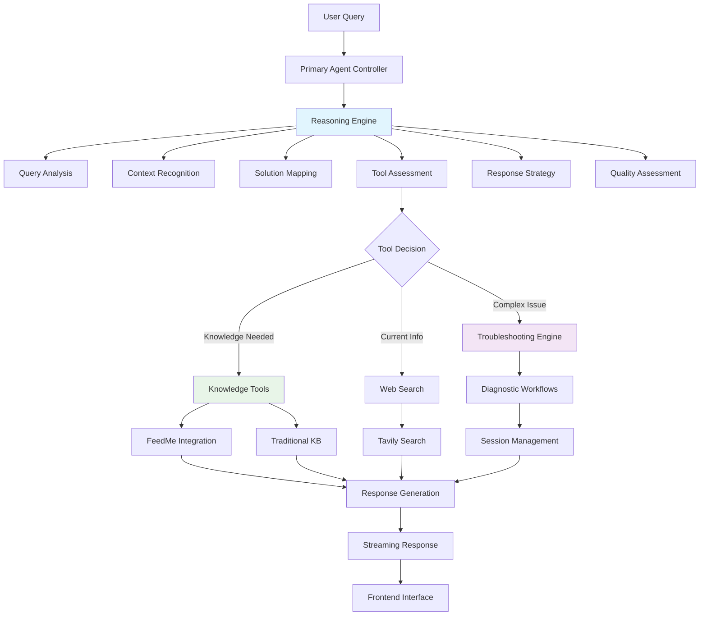
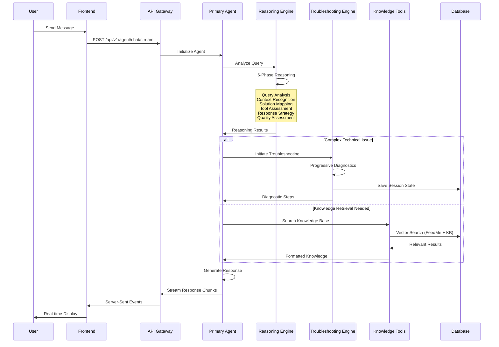
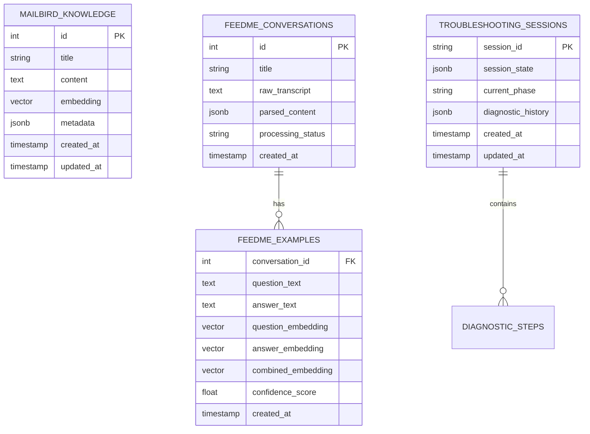

# MB-Sparrow Primary Agent Developer Guide (v25-07-03)

## 1. Overview

The Primary Agent (Agent Sparrow) is the core customer support intelligence engine of the MB-Sparrow multi-agent system. Built for Mailbird customer support, it combines advanced AI reasoning, emotional intelligence, and systematic troubleshooting capabilities to deliver enterprise-grade customer service automation.

**Key Capabilities:**
- **Advanced AI Reasoning**: 6-phase cognitive pipeline with chain-of-thought processing
- **Emotional Intelligence**: 8-state emotion detection with adaptive response strategies
- **Structured Troubleshooting**: 7-phase diagnostic workflows with progressive complexity
- **Intelligent Tool Selection**: Context-aware decision making for knowledge retrieval
- **Knowledge Integration**: Seamless blend of traditional KB and FeedMe customer examples

## 2. Backend Architecture



### Key Modules & Responsibilities

| Module | Purpose | Lines | Key Classes |
|--------|---------|-------|-------------|
| `agent.py` | Core orchestration & streaming | 450+ | `run_primary_agent()` |
| `reasoning_engine.py` | 6-phase AI reasoning pipeline | 800+ | `ReasoningEngine` |
| `troubleshooting_engine.py` | Structured diagnostics | 600+ | `TroubleshootingEngine` |
| `tool_intelligence.py` | Smart tool selection | 400+ | `ToolIntelligence` |
| `feedme_knowledge_tool.py` | Enhanced KB integration | 300+ | `FeedMeKnowledgeSearchTool` |
| `session_manager.py` | Session persistence | 350+ | `SessionManager` |

## 3. Request Lifecycle



## 4. Key Files & Their Roles

| File Path | Purpose | Lines | Owner |
|-----------|---------|-------|-------|
| `app/agents_v2/primary_agent/agent.py` | Core agent orchestration & streaming | 450+ | Primary Agent |
| `app/agents_v2/primary_agent/reasoning/reasoning_engine.py` | 6-phase AI reasoning pipeline | 800+ | Reasoning System |
| `app/agents_v2/primary_agent/reasoning/tool_intelligence.py` | Intelligent tool selection logic | 400+ | Tool Intelligence |
| `app/agents_v2/primary_agent/reasoning/problem_solver.py` | 5-step problem solving framework | 350+ | Problem Solver |
| `app/agents_v2/primary_agent/troubleshooting/troubleshooting_engine.py` | Structured troubleshooting orchestration | 600+ | Troubleshooting |
| `app/agents_v2/primary_agent/troubleshooting/diagnostic_sequencer.py` | Progressive diagnostic workflows | 500+ | Diagnostics |
| `app/agents_v2/primary_agent/troubleshooting/session_manager.py` | Session persistence & analytics | 350+ | Session Mgmt |
| `app/agents_v2/primary_agent/feedme_knowledge_tool.py` | Enhanced KB search with FeedMe | 300+ | Knowledge Tools |
| `app/agents_v2/primary_agent/prompts/agent_sparrow_prompts.py` | System prompts & templates | 1200+ | Prompts |
| `app/agents_v2/primary_agent/prompts/emotion_templates.py` | Emotional intelligence templates | 400+ | Emotion AI |
| `app/agents_v2/primary_agent/schemas.py` | Data structures & validation | 200+ | Schemas |
| `app/agents_v2/primary_agent/tools.py` | Tool definitions & configs | 150+ | Tools |

## 5. API Surface (Backend ⇄ Frontend)

| Endpoint | Method | Path | Input | Output | Used by Component |
|----------|--------|------|-------|--------|-------------------|
| **Primary Chat** | POST | `/api/v1/agent/chat/stream` | `ChatRequest` | SSE Stream | `UnifiedChatInterface` |
| **Agent Health** | GET | `/api/v1/agent/health` | None | `AgentStatus` | `Header` |
| **Session Management** | GET | `/api/v1/agent/session/{id}` | `session_id` | `SessionData` | `SessionManager` |
| **Knowledge Search** | POST | `/api/v1/agent/knowledge/search` | `SearchRequest` | `SearchResults` | `KnowledgePanel` |
| **Troubleshooting** | POST | `/api/v1/agent/troubleshoot` | `TroubleshootRequest` | `DiagnosticSteps` | `TroubleshootingUI` |

### Request/Response Schemas

```typescript
// Primary chat request
interface ChatRequest {
  message: string;
  session_id?: string;
  conversation_id?: string;
  user_id?: string;
  context?: Record<string, any>;
}

// Streaming response format
interface StreamingResponse {
  role: 'assistant' | 'user' | 'system';
  content: string;
  agent_type: 'primary' | 'log_analysis' | 'research';
  metadata?: {
    reasoning_state?: ReasoningState;
    tool_usage?: ToolUsage[];
    session_id?: string;
  };
}
```

## 6. Database Schema & Queries



### Key Database Operations

```sql
-- Enhanced knowledge search with FeedMe integration
SELECT 
    fe.question_text,
    fe.answer_text,
    fe.confidence_score,
    fe.combined_embedding <=> %s::vector AS similarity_score
FROM feedme_examples fe
WHERE fe.is_active = true
ORDER BY fe.combined_embedding <=> %s::vector ASC
LIMIT 3;

-- Traditional KB search with relevance scoring
SELECT 
    mk.title,
    mk.content,
    mk.embedding <=> %s::vector AS similarity_score
FROM mailbird_knowledge mk
WHERE mk.embedding <=> %s::vector < 0.25
ORDER BY similarity_score ASC
LIMIT 5;

-- Troubleshooting session persistence
INSERT INTO troubleshooting_sessions 
(session_id, session_state, current_phase, diagnostic_history)
VALUES (%s, %s, %s, %s)
ON CONFLICT (session_id) 
DO UPDATE SET 
    session_state = EXCLUDED.session_state,
    current_phase = EXCLUDED.current_phase,
    diagnostic_history = EXCLUDED.diagnostic_history,
    updated_at = CURRENT_TIMESTAMP;
```

## 7. Frontend Integration

### React Component Tree

```
UnifiedChatInterface (Main Chat UI)
├── Header (Agent Status & Controls)
├── MessageList (Conversation History)
│   ├── MessageBubble (Individual Messages)
│   │   ├── AgentAvatar (Agent Sparrow Logo)
│   │   ├── MarkdownMessage (Rich Content)
│   │   └── MessageMetadata (Timestamps, etc.)
│   └── TypingIndicator (AI Processing)
├── InputSection (Message Input)
│   ├── MessageInput (Text Input)
│   ├── FileUpload (Attachment Support)
│   └── SendButton (Submit Control)
└── StatusBar (Connection Status)
```

### State & Props Flow

```typescript
// Main chat interface state
interface ChatState {
  messages: Message[];
  isStreaming: boolean;
  currentAgent: AgentType;
  sessionId: string;
  connectionStatus: 'connected' | 'disconnected' | 'connecting';
}

// Message bubble props
interface MessageBubbleProps {
  message: Message;
  isUser: boolean;
  agentType: AgentType;
  showAvatar: boolean;
  onReaction?: (reaction: string) => void;
}

// Agent avatar component
const AgentAvatar: React.FC<{agentType: AgentType}> = ({ agentType }) => (
  <Avatar className="ring-1 ring-accent/30 bg-accent/10">
    <AvatarImage src="/agent-sparrow.png" alt="Agent Sparrow" />
    <AvatarFallback className="bg-accent/10 text-accent">AS</AvatarFallback>
  </Avatar>
);
```

### Key Frontend Features

- **Real-time Streaming**: Server-sent events for live responses
- **Markdown Rendering**: Rich text support for primary agent responses
- **Agent Avatars**: Visual distinction between different agents
- **Mailbird Branding**: Consistent blue accent (#0095ff) throughout
- **Accessibility**: WCAG 2.1 AA compliant with proper focus management

## 8. Configuration & Environment

### Environment Variables

```bash
# Core Agent Configuration
GEMINI_API_KEY=your_gemini_key_here          # Required for Gemini 2.5 Flash
GEMINI_MODEL_NAME=gemini-2.5-flash          # AI model selection

# Knowledge Base Configuration
KB_RELEVANCE_THRESHOLD=0.25                  # Similarity threshold for KB search
FEEDME_ENABLED=true                          # Enable FeedMe integration
FEEDME_MAX_RETRIEVAL_RESULTS=3               # Max FeedMe results per query

# Reasoning Engine Configuration
REASONING_ENABLE_CHAIN_OF_THOUGHT=true       # Enable detailed reasoning
REASONING_ENABLE_TOOL_INTELLIGENCE=true      # Enable smart tool selection
REASONING_ENABLE_PROBLEM_SOLVING=true        # Enable structured problem solving
REASONING_ENABLE_QUALITY_ASSESSMENT=true     # Enable response quality scoring

# Troubleshooting Configuration
TROUBLESHOOTING_ENABLE_ADAPTIVE_WORKFLOWS=true    # Enable adaptive workflows
TROUBLESHOOTING_ENABLE_PROGRESSIVE_COMPLEXITY=true # Enable complexity scaling
TROUBLESHOOTING_ENABLE_VERIFICATION_CHECKPOINTS=true # Enable verification
TROUBLESHOOTING_ENABLE_AUTOMATIC_ESCALATION=true   # Enable auto-escalation
TROUBLESHOOTING_DEBUG=false                        # Debug mode

# Performance Configuration
AGENT_RATE_LIMIT_REQUESTS=100                # Rate limiting
AGENT_RATE_LIMIT_PERIOD=60                   # Rate limit period (seconds)
AGENT_MAX_QUERY_LENGTH=4000                  # Max query characters
AGENT_CONTEXT_LIMIT=3500                     # Context truncation limit
```

### Feature Flags

```python
# Feature flag configuration in settings.py
REASONING_CONFIG = {
    "enable_chain_of_thought": True,
    "enable_problem_solving_framework": True,
    "enable_tool_intelligence": True,
    "enable_quality_assessment": True,
    "enable_reasoning_transparency": True
}

TROUBLESHOOTING_CONFIG = {
    "enable_adaptive_workflows": True,
    "enable_progressive_complexity": True,
    "enable_verification_checkpoints": True,
    "enable_automatic_escalation": True,
    "integrate_with_reasoning_engine": True
}
```

## 9. Known Gaps / Technical Debt

### Current Limitations

1. **Reasoning Engine Memory**: No persistent memory between sessions for learning user preferences
2. **Tool Intelligence Cache**: Tool decision results not cached, causing repeated analysis
3. **Troubleshooting Analytics**: Limited analytics on troubleshooting success rates
4. **Emotional Intelligence Training**: Emotion detection patterns are rule-based, not ML-trained
5. **Session Persistence**: Troubleshooting sessions stored in database but not optimized for high concurrency

### Technical Debt Items

1. **Prompt Template Management**: Hard-coded prompts should be externalized to configuration
2. **Error Handling**: Inconsistent error handling across reasoning components
3. **Testing Coverage**: Limited integration tests for complex reasoning flows
4. **Performance Monitoring**: No detailed performance metrics for reasoning phases
5. **Configuration Complexity**: Too many environment variables, needs centralized config management

### Security Considerations

1. **Input Validation**: Query length limits exist but content validation could be enhanced
2. **Rate Limiting**: Basic rate limiting implemented but needs user-specific limits
3. **Data Sanitization**: User inputs sanitized but troubleshooting outputs need validation
4. **Session Security**: Session IDs are UUIDs but no expiration mechanism implemented

## 10. Future-proofing Recommendations

### Short-term Improvements (1-3 months)

1. **Enhanced Caching**
   - Implement Redis-based caching for tool decisions
   - Cache frequent knowledge search results
   - Add session-based user preference caching

2. **Improved Analytics**
   - Add detailed metrics for reasoning phase performance
   - Implement troubleshooting success rate tracking
   - Create dashboards for agent performance monitoring

3. **Configuration Management**
   - Centralize all configuration in a single config service
   - Add runtime configuration updates without restart
   - Implement A/B testing framework for prompt variations

### Medium-term Enhancements (3-6 months)

1. **Advanced Emotional Intelligence**
   - Train ML models on customer interaction data
   - Implement sentiment analysis integration
   - Add emotional state transitions and learning

2. **Enhanced Troubleshooting**
   - Add machine learning for diagnostic accuracy
   - Implement automated solution validation
   - Create customer feedback loops for improvement

3. **Multi-modal Support**
   - Add image analysis for screenshots
   - Implement voice input processing
   - Support for structured data inputs (JSON, XML)

### Long-term Vision (6+ months)

1. **Autonomous Learning**
   - Self-improving knowledge base through interaction analysis
   - Automated prompt optimization based on success metrics
   - Dynamic workflow adaptation based on customer patterns

2. **Advanced Integration**
   - Direct integration with Mailbird client telemetry
   - Real-time system health monitoring integration
   - Cross-platform support for mobile and web clients

3. **Scalability Enhancements**
   - Distributed reasoning across multiple model instances
   - Horizontal scaling with load balancing
   - Advanced caching and CDN integration

## 11. Changelog Reference Links

- **Agent Sparrow v8.0**: Structured troubleshooting implementation (2025-06-24)
- **Agent Sparrow v7.0**: Advanced reasoning framework (2025-06-24)
- **Chat Polish v6.1**: UI refinement with Mailbird branding (2025-06-23)
- **Enhanced Knowledge Integration**: FeedMe integration with semantic search (2025-06-22)
- **Emotional Intelligence System**: 8-state emotion detection (2025-06-21)
- **Tool Intelligence Framework**: Smart tool selection with transparency (2025-06-20)

### Key Architectural Decisions

1. **Gemini 2.5 Flash Selection**: Chosen for optimal balance of speed and reasoning capability
2. **Streaming Response Architecture**: Enables real-time user experience with chunked responses
3. **Modular Reasoning Design**: Separates concerns for maintainability and testing
4. **Progressive Troubleshooting**: Adapts complexity based on customer technical level
5. **Hybrid Knowledge Search**: Combines traditional KB with customer example learning

---

*This document represents the current state of the Primary Agent system as of 2025-07-03. For the most up-to-date information, refer to the codebase and recent commit history.*